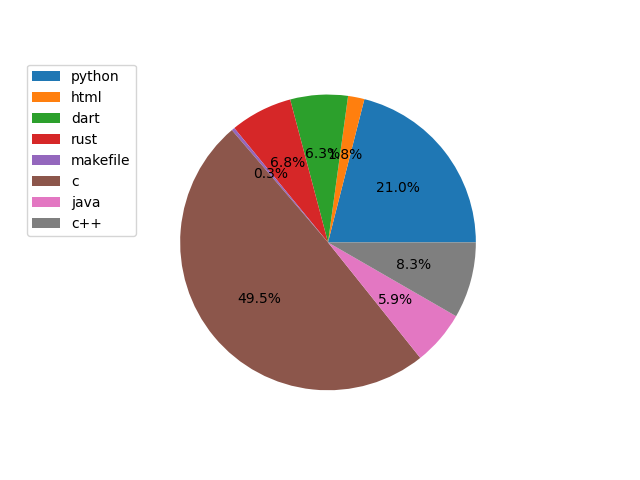
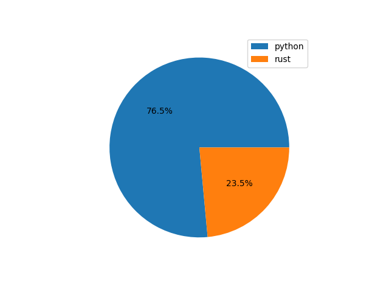
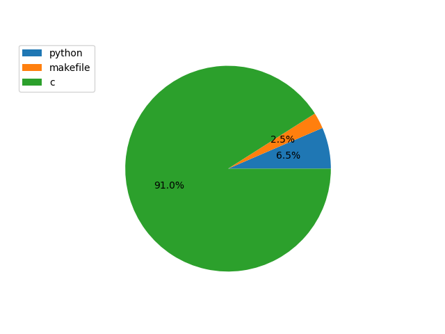
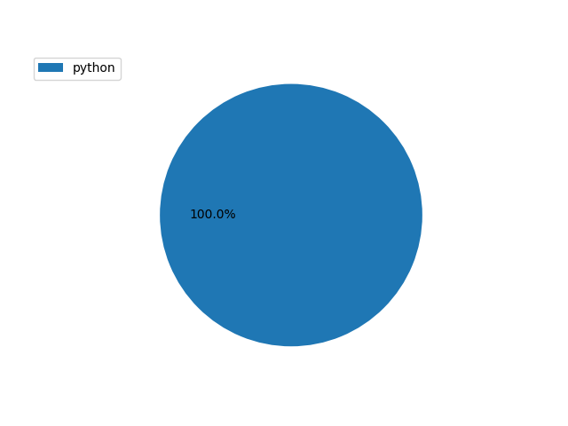
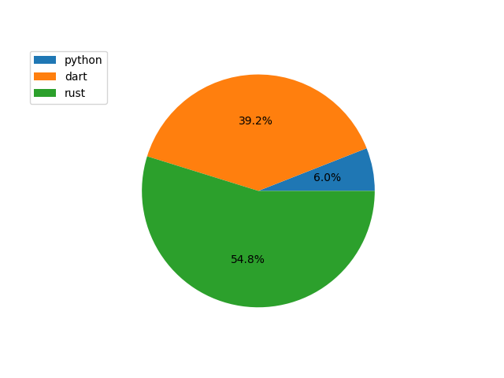
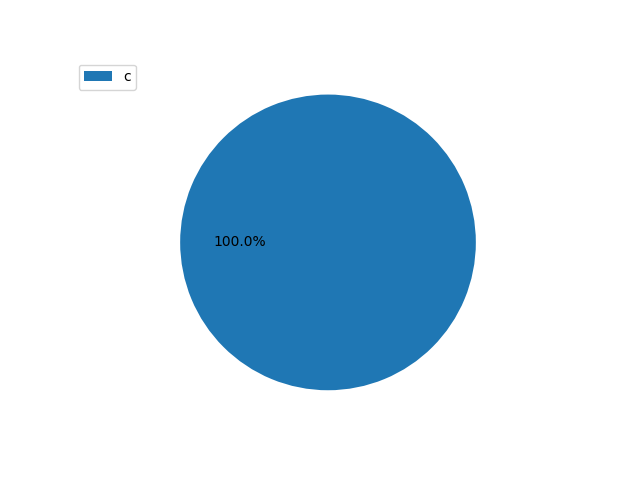
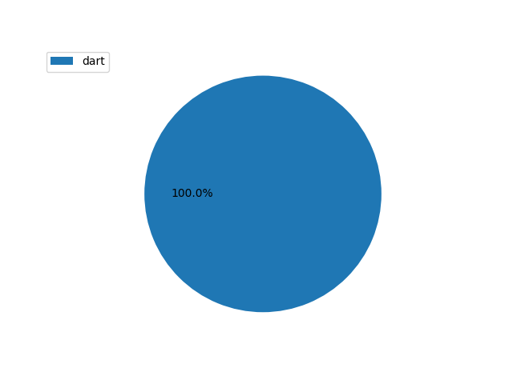
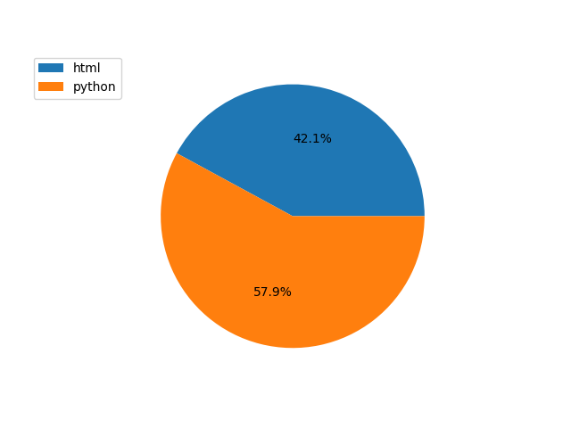
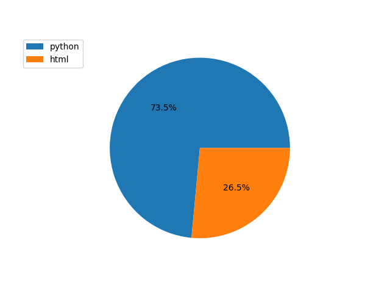

# sistemas distribuidos

# estrutura de dados

# processamento digital de imagens

# desenvolvimento integrado de sistemas

# fundamentos de programação

# comunicação de dados

# sistemas inteligentes

# sistemas operacionais 

# redes

# analise desenvolvimento de sistemas

