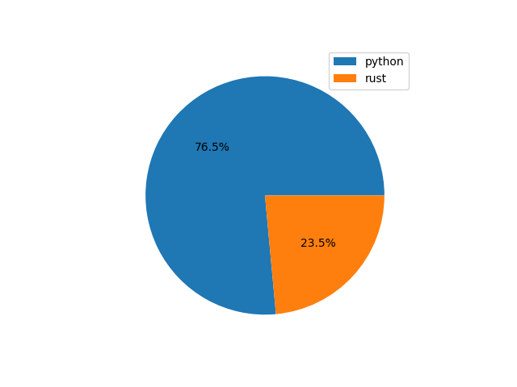

trabalhos de sistemas distruibuidos
professora: Ana Cristina Barreiras Kochem Vendramin

# agendador_eventos_pyro 
versão python usando pyro(miidleware para compartilhar acesso de metodos entre cliente e servidor)

# agendador_eventos_rest
## versão do agendando de eventos usando web service rest
* cliente em rust
* servidor em python

# assinatura, pequenos teste para implementar assinatura em python

#pyro, pequenos testes para implementar o pyro
